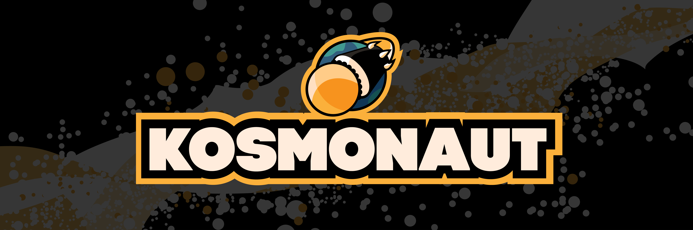
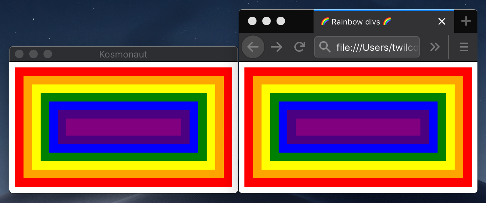

---

 

Kosmonaut is a web browser engine created to serve as the vehicle for your journey across the world wide web.

> The road to the stars is steep and dangerous.  But we're not afraid...space flights can't be stopped.
> 
> \- Yuri Gagarin

### What can Kosmonaut do?

So far, not much.  Only a very limited subset of CSS is currently supported, so most web pages will not work.  However, given very basic HTML and CSS, Kosmonaut does render the right things — see Kosmonaut's rendering of [this code](https://github.com/twilco/kosmonaut/blob/eef5274c252038062049769861d02354cbaa4b2a/web/rainbow-divs-incl-css.html), compared with that of Firefox:

Here is a summary of things Kosmonaut can do, things I'm currently working on, and things that are towards the front of the todo list.

- [x] Parse HTML and small subset of CSS into DOM and rules, cascade CSS and apply to DOM
- [x] Layout and paint of normal flow, block formatting context block-level boxes.
     - [x] Partial support for [abstract box layout](https://drafts.csswg.org/css-writing-modes-4/#abstract-layout) with `writing-mode` and `direction` properties
- [x] Layout-tree-dump based testing
- [x] Support for arbitrary scale factors (e.g. high-DPI monitors)
- [ ] Text rendering with FreeType (without support for text layout — see next item)
- [ ] Support for normal flow, inline formatting context layout and paint

### Project goals

Kosmonaut was created with the intention of learning browser engine development.  However, the project has come a little ways now, and I've been thinking about niches I can work towards fitting Kosmonaut into.  I've shared some thoughts on potential niches [in this issue](https://github.com/twilco/kosmonaut/issues/6), and would love to hear your ideas too. 

### Build and test

Kosmonaut is built with Rust using OpenGL bindings via [gl-rs](https://github.com/brendanzab/gl-rs), [Glutin](https://github.com/rust-windowing/glutin) for window management and OpenGL context creation, Servo's [html5ever](https://github.com/servo/html5ever) and [cssparser](https://github.com/servo/rust-cssparser) for HTML and CSS parsing, and various other auxiliary libraries.

To build from source:

1. Install Rust: https://www.rust-lang.org/tools/install
2. `cargo build`

Kosmonaut does not currently support any networking.  To render HTML and CSS with Kosmonaut, you may instead run the executable you just built passing any number of HTML and CSS files via the `--files` (or `-f`) flag.

`cargo run -- --files my.html my.css more.css`

To run the rainbow divs example pictured above, try:

`cargo run -- --files tests/websrc/rainbow-divs.html tests/websrc/rainbow-divs.css`

To run the tests, both unit and layout, run:

`cargo test`

For layout tests, Kosmonaut transforms the given HTML and CSS into the layout tree and dumps that as text.  Those text snapshots are verified with [insta](https://docs.rs/insta/latest/insta/index.html).

If you need to review / update snapshots, it is helpful to install the Cargo insta CLI tool like so:

`cargo install cargo-insta`
 
### License and credits

Kosmonaut's current implementation is heavily inspired by [Servo](https://github.com/servo/servo), sometimes taking code directly from it.  Thus, Kosmonaut is licensed with the [Mozilla Public License 2.0](https://www.mozilla.org/en-US/MPL/2.0/).

Kosmonaut also takes inspiration from [Robinson](https://github.com/mbrubeck/robinson).  Thanks to [mbrubeck](https://github.com/mbrubeck) for their great series of articles on browser engines.

Finally, Kosomonaut's DOM implementation was taken from [Kuchiki](https://github.com/kuchiki-rs/kuchiki) and has been slightly modified to fit our needs.
